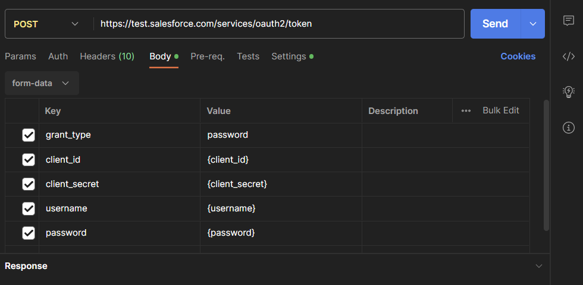
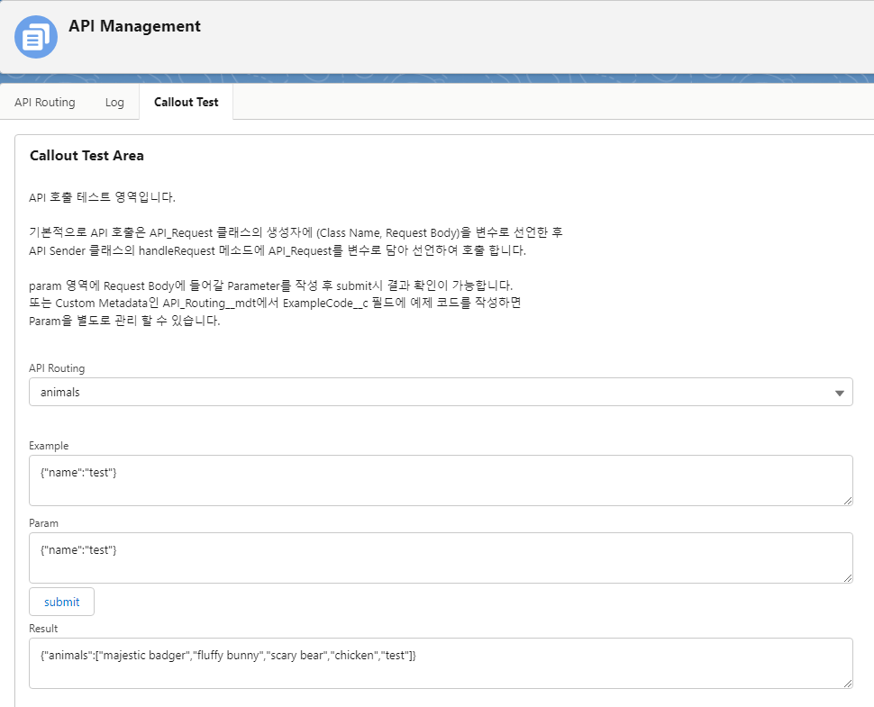

# Salesforce DX Project: Next Steps

Now that you’ve created a Salesforce DX project, what’s next? Here are some documentation resources to get you started.

## How Do You Plan to Deploy Your Changes?

Do you want to deploy a set of changes, or create a self-contained application? Choose a [development model](https://developer.salesforce.com/tools/vscode/en/user-guide/development-models).

## Configure Your Salesforce DX Project

The `sfdx-project.json` file contains useful configuration information for your project. See [Salesforce DX Project Configuration](https://developer.salesforce.com/docs/atlas.en-us.sfdx_dev.meta/sfdx_dev/sfdx_dev_ws_config.htm) in the _Salesforce DX Developer Guide_ for details about this file.

## Read All About It

- [Salesforce Extensions Documentation](https://developer.salesforce.com/tools/vscode/)
- [Salesforce CLI Setup Guide](https://developer.salesforce.com/docs/atlas.en-us.sfdx_setup.meta/sfdx_setup/sfdx_setup_intro.htm)
- [Salesforce DX Developer Guide](https://developer.salesforce.com/docs/atlas.en-us.sfdx_dev.meta/sfdx_dev/sfdx_dev_intro.htm)
- [Salesforce CLI Command Reference](https://developer.salesforce.com/docs/atlas.en-us.sfdx_cli_reference.meta/sfdx_cli_reference/cli_reference.htm)

---

API Framework for Salesforce

Salesforce의 API의 기반을 잡아 유지보수를 용이하게 하고, 개발 속도 향상 및 비용을 낮추기 위해 개발되었습니다.

## Package Install URL - 1.2
: https://login.salesforce.com/packaging/installPackage.apexp?p0=04t2w0000093ng0

## 주의

- Nebula Logger Package를 사용하기 때문에, 먼저 등록 후 진행해주셔야 합니다.
- Nebula Logger Git URL : https://github.com/jongpie/NebulaLogger

## 특징

1. API Gateway를 송, 수신별로 나누고, 서비스 개발 영역도 구분, 파라미터를 구분하여 여러 환경에 대응 가능한 활용성 증대 추구.
2. API Service 정보를 Custom Metadata(API_Routing__mdt)로 관리, API Management를 통해 코드 수정 없이 경로, 사용여부 등 변경 가능하게 하여 개발 및 운영의 용이성 up.
3. Nebula Logger를 활용하여 Log를 API Management에서 서비스 별로 확인 가능.
4. Callout Test Tab을 통해 쉽게 API 테스트 가능.

## API_Routing__mdt

<table>
    <thead>
        <tr>
            <th>API_Routing__mdt</th>
            <th>Field API Name</th>
            <th>Description</th>
        </tr>
    </thead>
    <tbody>
        <tr>
            <td></td>
            <td>InterfaceID__c</td>
            <td>API Service 관리 Id(Key)</td>
        </tr>
        <tr>
            <td></td>
            <td>URI__c</td>
            <td>API Service Endpoint URI</td>
        </tr>
        <tr>
            <td></td>
            <td>HttpMethod__c</td>
            <td>HTTP Method Type</td>
        </tr>
        <tr>
            <td></td>
            <td>isActive__c</td>
            <td>API Service 사용 여부</td>
        </tr>
        <tr>
            <td></td>
            <td>Description__c</td>
            <td>비고</td>
        </tr>
        <tr>
            <td></td>
            <td>ServiceClass__c</td>
            <td>API Service Class Name</td>
        </tr>
        <tr>
            <td></td>
            <td>ExampleParam__c</td>
            <td>호출 예제 파라미터</td>
        </tr>
        <tr>
            <td></td>
            <td>LegacySystem__c</td>
            <td>Outbound 대상 시스템 명</td>
        </tr>
        <tr>
            <td></td>
            <td>Timeout__c</td>
            <td>Read timeout 설정 값</td>
        </tr>
        <tr>
            <td></td>
            <td>Direction__c</td>
            <td>송수신 여부</td>
        </tr>
        <tr>
            <td></td>
            <td>MappingDefinition__c</td>
            <td>Record 매핑 정보</td>
        </tr>
        <tr>
            <td></td>
            <td>Headers__c</td>
            <td>헤더 정보</td>
        </tr>
    </tbody>
</table>

## API Manager ERD


## Inbound API Service

#### 서비스 개발 예시 코드
```java
/*

InterfaceId : TEST01

송신, 조회 서비스의 경우 Request Body는 내부CRM 담당자와 협의하여 결정한다.

클래스 선언 규칙은 API_(InterfaceID)_ + 송신은 Sender / 수신은 Receiver / 조회는 Search로 한다.

*/
public with sharing class API_TEST01_Receiver extends API_Service{
    public API_TEST01_Receiver() {}
    
    //수신, 송신 여부에 따라 해당하는 메소드 오버라이드 하여 개발.
    public override RestResponse execute(RestRequest request, RestResponse response){
        RestResponse result = response;

        try{
            //Request Body를 매핑 클래스 형태에 맞게 변환.
            List<mapperClass> mapperList = (List<mapperClass>)JSON.deserialize(request.requestBody.toString(), List<mapperClass>.class);
            //데이터를 적재할 Object List
            List<Account> objList = new List<Account>();

            //데이터 매핑 작업
            for(mapperClass ifObj : mapperList){
                objList.add(ifObj.convert());
            }

            //데이터 DML 처리
            Insert objList;

            //전달할 Response 정보
            result.responseBody = Blob.valueOf(JSON.serialize(new API_Response(objList)));
        }catch(Exception e){
            API_Response errorResponse = new API_Response();
            errorResponse.createUnhandledExcepionResponse(e.getMessage());
            System.debug(e.getStackTraceString());
            
            // An error occured
            result.statusCode = 500;
            result.responseBody = Blob.valueOf(JSON.serialize(errorResponse));
        }

        return result;
    }

    //매핑 클래스
    public class mapperClass {
        public String NAME      {get;set;}
        public String MDMCODE   {get;set;}
        public String PHONE     {get;set;}

        public Account convert(){
            Account obj = new Account();

            obj.Name = this.NAME;
            obj.AccountNumber = this.MDMCODE;
            obj.Phone = this.PHONE;

            return obj;
        }
    }
}
```

#### Inbound API Service 테스트 가이드


1. https://test.salesforce.com/services/oauth2/token에 POST로 위 이미지의 데이터를 Header 또는 Body에 담아 호출 시 Access Token 수집 가능.
2. 전달받은 Access Token을 Header에 담고, 호출하려는 서비스의 파라미터 형태에 맞게 Body에 담아 호출하여 테스트 결과 확인.

## Outbound API Service

#### 서비스 개발 예시 코드
(참조 링크 : https://trailhead.salesforce.com/ko/content/learn/modules/apex_integration_services/apex_integration_rest_callouts)

위 링크의 makePostCallout 메소드 부분과 같은 서비스.

```java
/**
 * @description       : 
 * @author            : hj.jo@dkbmc.com
 * @group             : 
 * @last modified on  : 06-21-2023
 * @last modified by  : hj.jo@dkbmc.com
**/
/*

InterfaceId : TEST05

송신, 조회 서비스의 경우 Request Body는 내부CRM 담당자와 협의하여 결정한다.

클래스 선언 규칙은 API_(InterfaceID)_ + 송신은 Sender / 수신은 Receiver / 조회는 Search로 한다.

*/
public with sharing class API_TEST05_Search extends API_Service{
    //수신, 송신 여부에 따라 해당하는 메소드 오버라이드 하여 개발.
    public override httpResponse execute(API_Request request){
        httpResponse result = new httpResponse();
        try{

            /* Request 세팅 */
            String accessToken = getOAuthToken();
            request.headers.put('Authorization', 'Bearer ' + accessToken);

            //Request Body를 전달
            result = callout(request);

            /* Response Body 가공 및 처리 영역 */
            List<sObject> objList = new Mapper().jsonToObject(request.mappingDefinition, (Object)result.getBody());
            Insert objList;

        }catch(Exception e){
            // An error occured
            result.setStatusCode(500);
            result.setStatus(e.getStackTraceString());
        }

        return result;
    }

    public String getOAuthToken(){
        String result;
        httpResponse response = new httpResponse();
        Map<String, Object> resMap = new Map<String, Object>();
        
        try{
            API_Request request = new API_Request();
            request.uri = 'https://login.salesforce.com/services/oauth2/token';
            request.requestBody = 'grant_type=password' + 
                                    '&client_id=' + '3MVG9n_HvETGhr3CKoyvBOQAOKIYzJvWCcvh1B9Cop12v21nET_jijmkKqD0OhEZvrJN5E5UuVkwAUDSXNbbk' + 
                                    '&client_secret=' + '776C475D43366D98C48C93D21077D8865149B4A0E5611BF35B3A84F07771F888' + 
                                    '&username=' + 'hj.jo@dkbmc.com.dev' + 
                                    '&password=' + 'dkbmc123';  
            request.httpMethod = 'POST';
            request.headers.put('Content-Type','application/x-www-form-urlencoded');

            response = callout(request);

            resMap = (Map<String, Object>)JSON.deserializeUntyped(response.getBody());
            result = (String)resMap.get('access_token');
            
        }catch(Exception e){
            // An error occured
            response.setStatusCode(500);
            response.setStatus(e.getStackTraceString());
        }

        return result;
    }

    public class Mapper extends API_Mapper{}
}
```

#### Outbound API Service 테스트 가이드

1. API Routing 선택
2. Param 영역에 Request Body값 입력
3. submit 버튼 클릭 및 결과 확인

서비스 개발 예시 코드는 어디까지나 예시입니다. 각 서비스의 파라미터는 근 틀만 구성하였기 때문에
위 예시 코드를 따를 필요는 없습니다.

## API_Mapper


API_Mapper는 위 그림과 같이 전달받을 JSON 데이터와 매핑정의 정보를 취합하여 List<sObject>로 매핑 및 반환하여 주는 클래스입니다.

추상 클래스이기 때문에 사용 시 상속 클래스를 선언하여 사용해주어야 합니다.

ex) 
```java
public class Mapper extends API_Mapper{}
```
코드 사용 예 )
```java 
List<sObject> objList 
= new Mapper().jsonToObject([Mapping Definition], [JSON Param]);
```

[Mapping Definition], [JSON Param]는 모두 Object 타입으로 전달하여야 합니다.

[Mapping Definition] ex)
```json
{
    "Account" : {
        "NAME" : {"value" : "Name", "type" : "String"}
        , "MDMCODE" : {"value" : "AccountNumber", "type" : "String"}
        , "PHONE" : {"value" : "phone", "type" : "String"}
        , "USEYN" : {"value" : "isActive__c", "type" : "Boolean"}
        ,"CREATEDDATE" : {"value" : "ifDate__c", "type" : "Date"}
        ,"CREATEDDATETIME" : {"value" : "ifDatetime__c", "type" : "Datetime"}
        ,"COLOR" : {"value" : "ifMultiPicklist__c", "type" : "Picklist"}
        ,"TIME" : {"value" : "ifTime__c", "type" : "Time"}
    }
    ,"Contact" : {
        "NAME" : {"value" : "LastName", "type" : "String"}
    }
 }
```
 기본적으로 매핑 정의 정보는 Object명으로 관리하며 내부 값으로 필드명과 해당 필드와 매핑할 필드 API명, 객체 타입으로 관리합니다.
```json
 [JSON Param] ex)
 {
    "Account" : [
        {
            "NAME" : "TEST"
            ,"MDMCODE" : "TEST"
            ,"PHONE" : "01012345678"
            ,"USEYN" : "Y"
            ,"CREATEDDATETIME" : "2023-06-13T11:01:24"
            ,"CREATEDDATE" : "2023-06-13"
            ,"COLOR" : "Red;Yellow;Blue"
            ,"TIME" : "18:30"
            ,"Contact" : [
                {
                    "NAME" : "TEST"
                }
            ]
        }
    ]
}
```
전달 받을 JSON 파라미터는 위에서 정의한 Object명을 Key로 가지고 Value로 배열 정보를 가지는 형태로
전달 받아야 합니다.